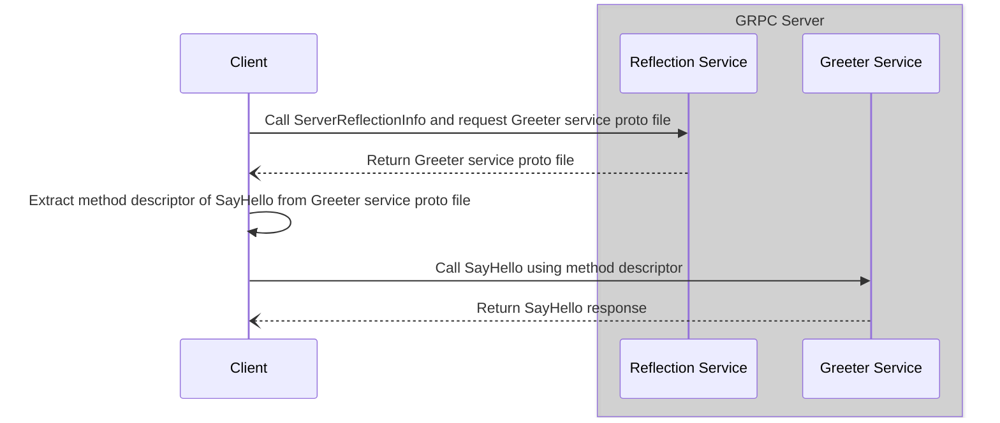
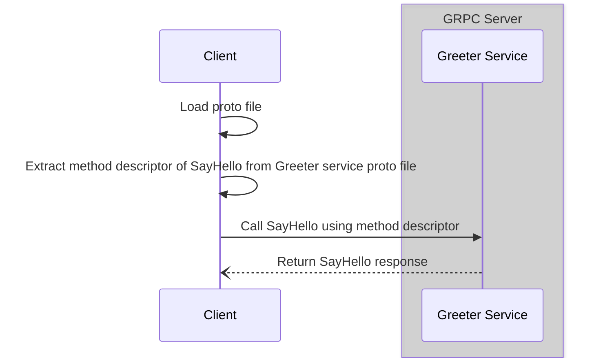

# How to call GRPC methods dynamically in GO

This repository shows code examples of calling gprc dynamically in go as explained at 

## Usage

1. Install proto compiler (protoc) - https://protobuf.dev/installation/
2. Install dependencies executing `make deps`
3. Run `make run-server` to execute server, 
4. Run `make run-server-reflection-call` to execute client calls using server reflection

## Sequence diagram for calling GRPC method using server reflection

## Sequence diagram for calling GRPC method using proto file

